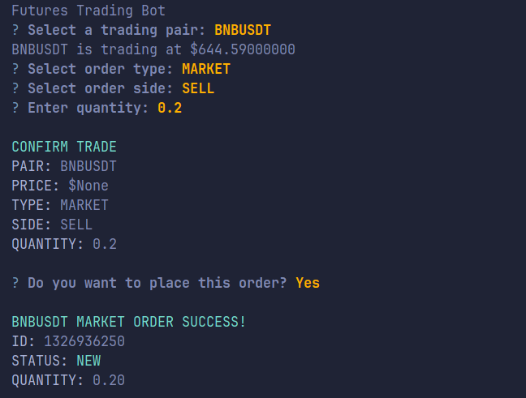

# Futures Trading Bot (Binance)

A command-line futures trading bot for placing **MARKET** and **LIMIT** orders on Binance via a guided terminal flow.



## Highlights

- Interactive CLI prompts for:
  - Trading pair
  - Order type (MARKET/LIMIT)
  - Side (BUY/SELL)
  - Quantity and (if needed) price
- Input validation for quantity and price
- Trade confirmation before execution
- File-based logging to `logs/trades.log`
- Binance API wrapper with testnet support enabled by default

## Project Structure

- [cli.py](cli.py) — entry point and trade flow orchestration
- [utils.py](utils.py) — CLI prompt helpers, execution routing, output formatting
- [bot/client.py](bot/client.py) — Binance API client wrapper
- [bot/orders.py](bot/orders.py) — order model and order execution methods
- [bot/validators.py](bot/validators.py) — quantity/price validation
- [bot/logging_config.py](bot/logging_config.py) — logging setup
- [trades.log](trades.log) - Log file for verification
- [.env.example](.env.example) — required environment variables template

## Requirements

- Python `3.12+` (see [.python-version](.python-version))
- Binance API key and secret (preferably testnet credentials)

## Setup

1. Clone the repository.
2. Create and activate a virtual environment.
3. Install dependencies.
4. Configure environment variables.

```bash
git clone https://github.com/priyanshuguptadev/binance-futures-trading-bot.git
cd binance-futures-trading-bot

uv venv
source venv/bin/activate  # On Windows: venv\Scripts\activate

uv sync

cp .env.example .env
# Edit .env to add your Binance API credentials
```

If you don't have testnet credentials, you can create them on the Binance Futures Testnet: https://testnet.binancefuture.com/en/futures/BTCUSDT
